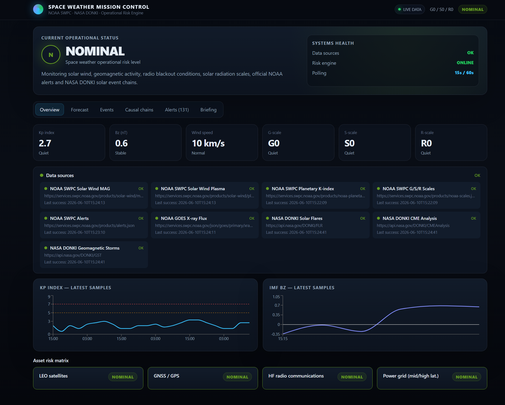

# Space Weather Mission Control

Sistema de monitoreo de clima espacial con datos reales de NOAA SWPC y NASA DONKI.
Diseñado como prototipo de monitoring/alerting para activos espaciales y terrestre.



## Arquitectura

```
NOAA SWPC ──┐
NASA DONKI ──┤──▶ FastAPI backend ──▶ React dashboard
GOES X-ray ──┘     (asyncio)
```

## Fuentes de datos

| Fuente | Datos | Frecuencia de ingesta |
|--------|-------|----------------------|
| NOAA SWPC `/products/solar-wind/mag-7-day.json` | IMF Bz, Bt | 60s |
| NOAA SWPC `/products/solar-wind/plasma-7-day.json` | Velocidad, densidad | 60s |
| NOAA SWPC `/products/noaa-planetary-k-index.json` | Kp index | 3min |
| NOAA SWPC `/products/noaa-scales.json` | Escalas G/S/R | 3min |
| NOAA SWPC `/products/alerts.json` | Alertas oficiales | 2min |
| NASA DONKI `/FLR` | Llamaradas solares | 5min |
| NASA DONKI `/CMEAnalysis` | Análisis CMEs | 5min |
| NASA DONKI `/GST` | Tormentas geomagnéticas | 5min |

## API propia

```
GET /alerts              # Alertas activas (filtro por severidad)
GET /alerts/history      # Histórico
GET /events              # Eventos DONKI (FLR/CME/GST)
GET /events/chains       # Cadenas causales correlacionadas
GET /risk-level          # Evaluación de riesgo por tipo de activo
GET /risk-level/{asset}  # Riesgo específico: leo_satellites | gnss_gps | hf_radio | power_grid
GET /solar-wind          # Viento solar actual
GET /solar-wind/history  # Histórico 24h
GET /solar-wind/kp       # Kp index + histórico
GET /forecast            # CMEs en tránsito con llegada estimada
GET /briefing            # Resumen ejecutivo (modo flight director)
```

## Setup

### Backend

```bash
cd backend
python -m venv venv
source venv/bin/activate  # Windows: venv\Scripts\activate
pip install -r requirements.txt

# Opcionalmente: NASA API key gratuita en https://api.nasa.gov/
# Sin key funciona con DEMO_KEY (rate limit 30 req/hora)
echo "NASA_API_KEY=tu_key_aqui" > .env

uvicorn app.main:app --reload --port 8000
```

### Frontend

```bash
cd frontend
npm install
npm run dev   # http://localhost:5173
```

## Motor de riesgo

El risk engine evalúa 4 perfiles de activos contra los índices actuales:

- **LEO satellites** — Kp, G-scale, S-scale (drag, charging, SEUs)
- **GNSS/GPS** — Kp, R-scale, S-scale (ionospheric scintillation)
- **HF radio** — Kp, R-scale (absorción ionosférica, blackouts)
- **Power grid** — Kp, G-scale (GIC en líneas de transmisión)

El Bz southward se usa como amplificador: Bz < -10 nT aumenta la puntuación de riesgo porque potencia el acoplamiento energético con la magnetosfera.

## Cadenas causales

El correlator explota el campo `linkedEvents` de DONKI para construir:

```
Llamarada solar → CME → Choque interplanetario → Tormenta geomagnética
```

Ejemplo real: la tormenta G5 de mayo 2024 fue rastreable desde la llamarada X3.9
en AR3664 del 8 de mayo, pasando por la CME de ~2000 km/s, hasta el impacto 62h después.

## Roadmap

- [ ] WebSocket para actualizaciones en tiempo real (Server-Sent Events)
- [ ] TimescaleDB para histórico persistente
- [ ] Notificaciones por email/Slack cuando nivel sube a "high"
- [ ] Modo "asset tracking" — seguimiento de satélites específicos por TLE
- [ ] Integración con SOHO LASCO para imágenes coronales
- [ ] Modelo de propagación WSA-Enlil para mejorar predicciones de llegada CME
